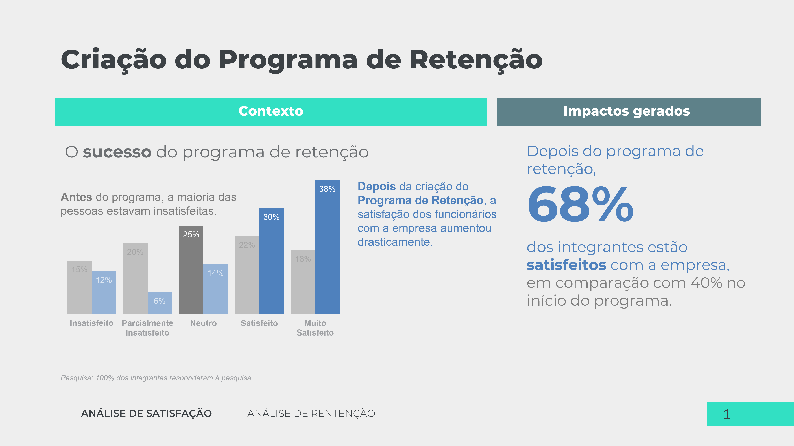
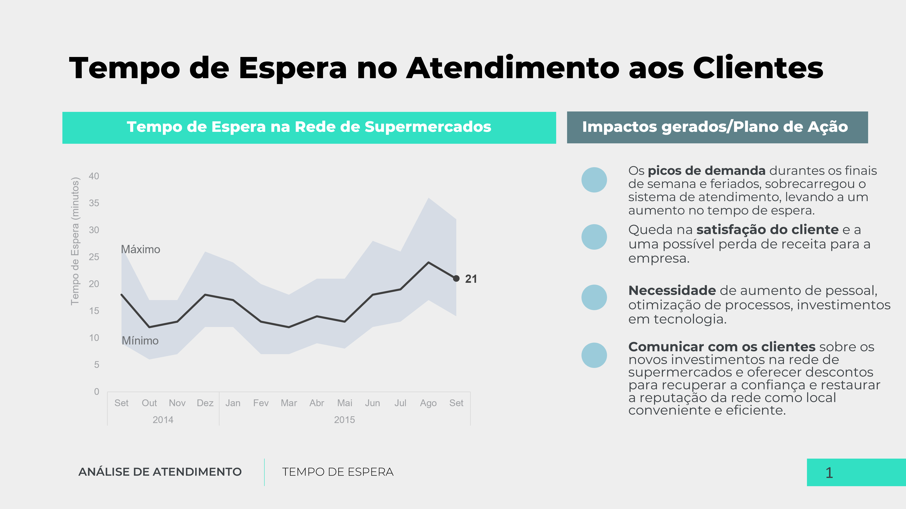
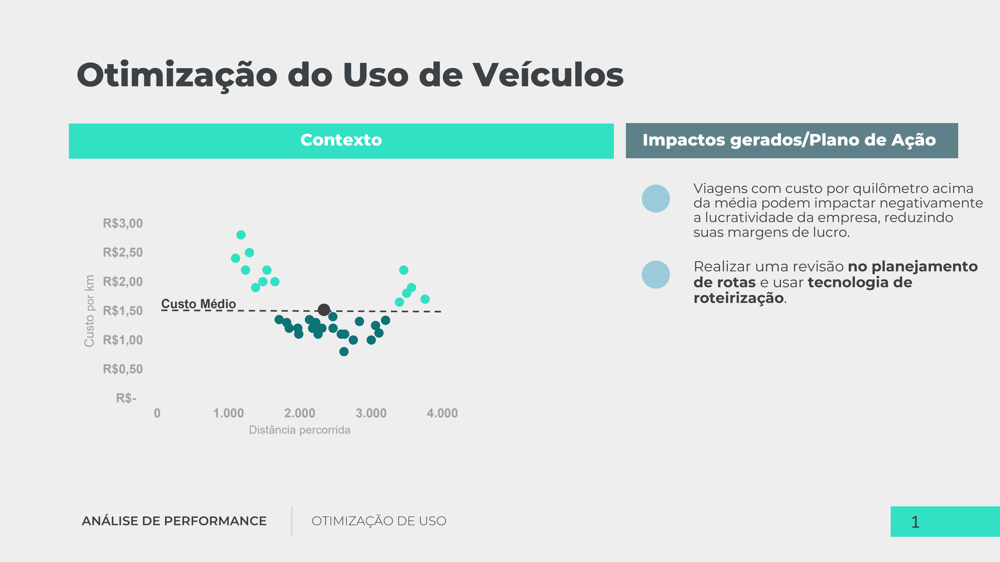
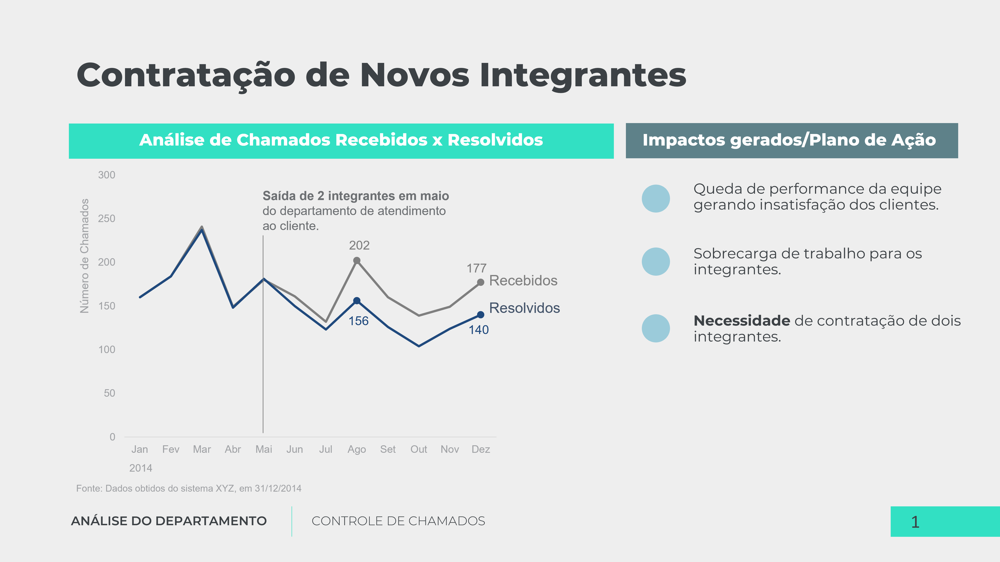
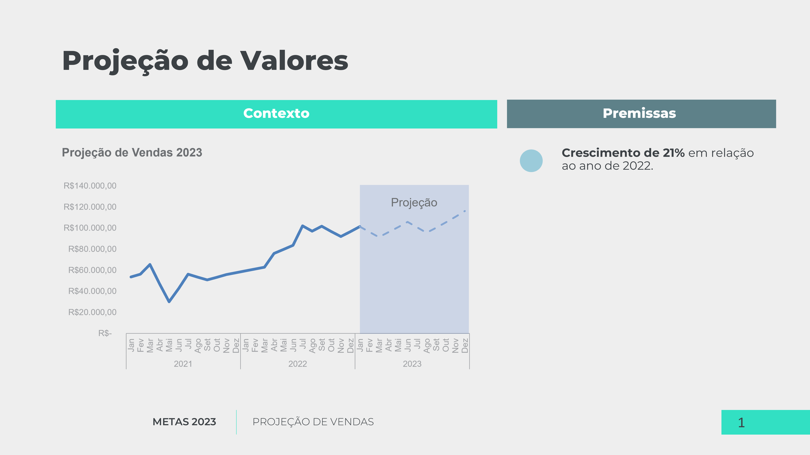

# Storytelling com dados usando o Excel e o PowerPoint

[Excel](pesquisa_de_satisfacao/pesquisa_de_satisfacao.xlsx) | [PowerPoint](pesquisa_de_satisfacao/pesquisa_de_satisfacao.pptx)
#

[Excel](tempo_de_espera/tempo_de_espera.xlsx) | [PowerPoint](tempo_de_espera/tempo_de_espera.pptx)
#

[Excel](custo_por_km_dirigido/custo_por_km_dirigido.xlsx) | [PowerPoint](custo_por_km_dirigido/custo_por_km_dirigido.pptx)
#

[Excel](analise_de_chamados/analise_de_chamados.xlsx) | [PowerPoint](analise_de_chamados/analise_de_chamados.pptx)
#

[Excel](projecao_de_vendas/projecao_de_vendas.xlsx) | [PowerPoint](projecao_de_vendas/projecao_de_vendas.pptx)
